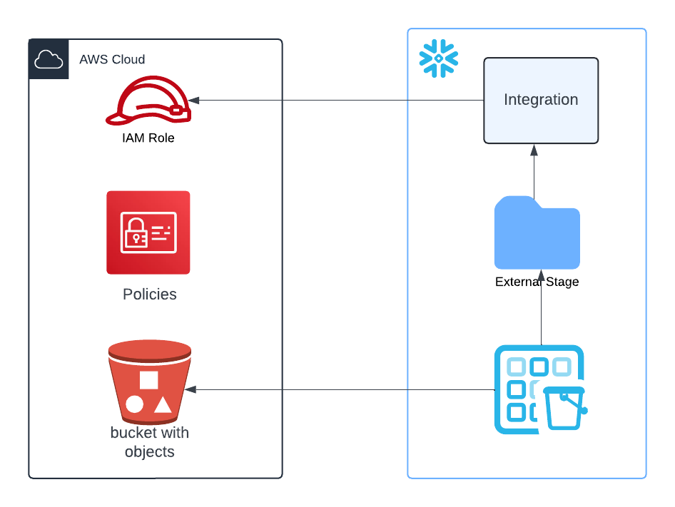
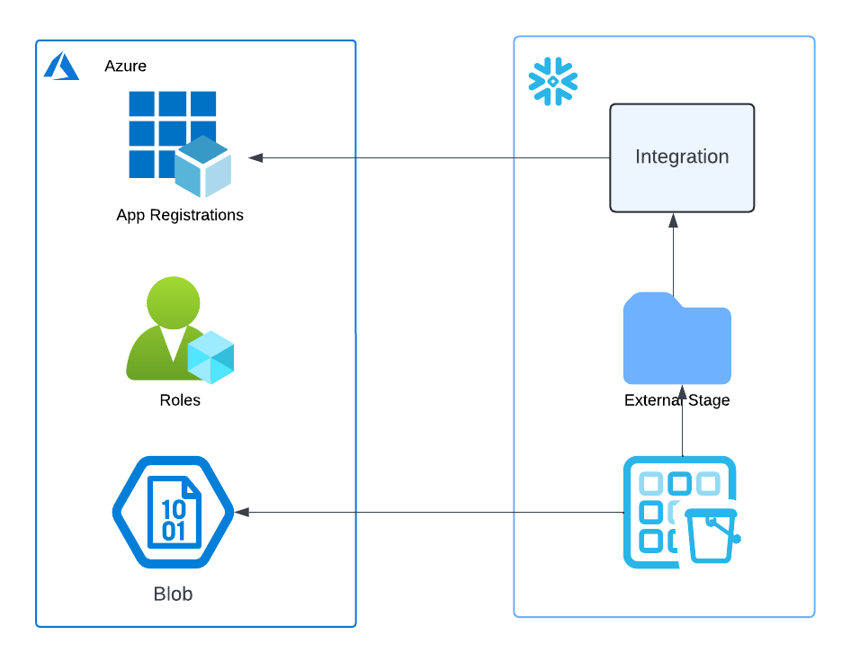

# ICEBERG Maker

This is a small streamlit app with the purpose of facilitating converting External Tables into Iceberg Parquet Direct Tables.

The app will allow you to take your current:

* **External Parquet Tables** or
* **External Delta Tables**

and migrate them to:

* **Parquet Direct Iceberg** or
* **Delta Direct Iceberg**.

Some background...

# External Tables

External tables in Snowflake allow users to query data stored outside Snowflake, such as in cloud storage (e.g., Amazon S3, Google Cloud Storage, or Microsoft Azure). Unlike regular tables, external tables don’t store data in Snowflake’s internal storage but reference the external location. These tables enable seamless querying of data without the need for ingestion, making it ideal for cases where data needs to stay in its original location. However, since the data is external, features like Snowflake's automatic optimization and performance tuning may be limited.

As can be seen from the diagrams, to create external tables you need to setup an integration.

Creating an integration involves setting up roles and permissions to establish a secure connection between Snowflake and the external data source. This process ensures that Snowflake has the necessary permissions to access and query the data stored in the external location.

# Iceberg

Iceberg is an open-source table format that provides a unified view of data across multiple storage systems. It is designed to work with existing data formats and storage systems, making it a flexible and scalable solution for managing large datasets.

Iceberg provides several benefits over traditional table formats, including:

1. **Unified view of data**: Iceberg allows you to create a unified view of data across multiple storage systems, making it easier to query and analyze data from different sources.
2. **Scalability**: Iceberg is designed to work with large datasets, making it a scalable solution for managing large amounts of data.

# Converting External Tables to Iceberg

Snowflake has embraced open table formats by adopting Iceberg. Becuase Iceberg uses parquet for storage, it is compatible with all the existing external tables that you have configured in Snowflake and you can also gain the improvements of the Iceberg engine.

In order to accelerate the adoption of Iceberg, we have created a tool that will convert your existing external tables to Iceberg.

The tool will leverage the existing integration settings that you currently have in your external tables, so you dont have to go and configure any of them and you can quickly get started with Iceberg.

The tool validates if your table columns data types are compatible with Iceberg. It will provide you the SQL assets you need to create your volume and table as well as compatible grants to the original table.

> The tool will use OBJECT_STORE as the catalog. That means that only READ-ONLY access will be used. No iceberg metadata will be saved for those tables. If you want to snowflake as your catalog or polaris, you will need make sure that the storage integration has the proper write capabilities. But that is out of the scope of this tool.

# Using Iceberg Maker

The easiest approach is to just leverage SiS (Streamlit in Snowflake).

* Login as an user with AccountAdmin priviledges.
* In Snowsight go to Project
  * Select Streamlit
  * Create a new Streamlit app
  * Copy the code from home.py and paste it into the editor.

# Usage Notes

If you search for external tables across all the account this might take a while. If you want to speed it up, you can use the filters to narrow the search to a particular database or schema.
